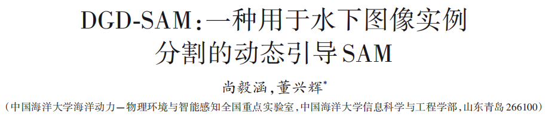
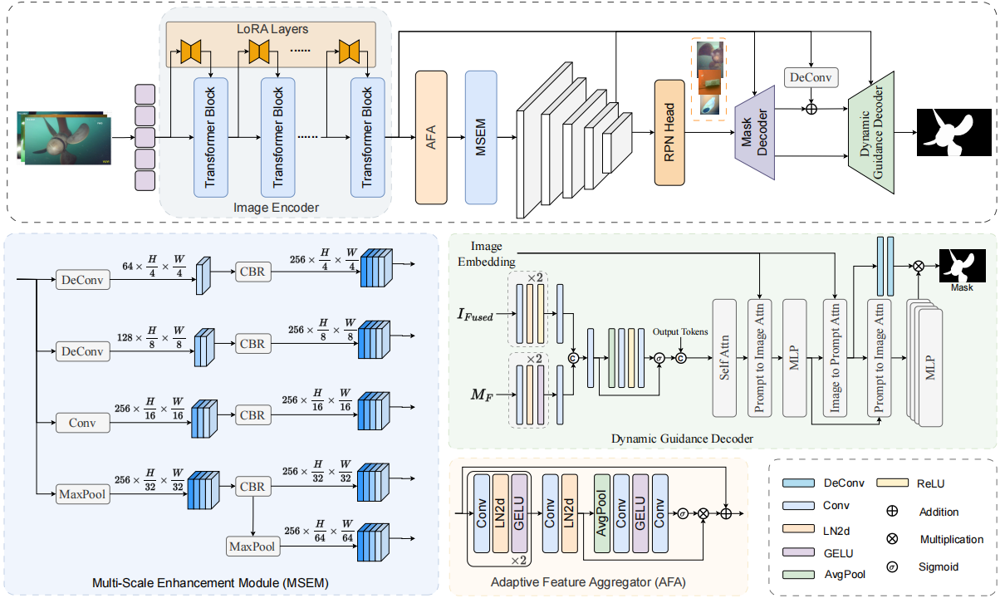

<p align="center"> 
<!-- <a href="https://www.sciencedirect.com/science/article/abs/pii/S0031320324002188" ></a> -->
<a href="https://indtlab.github.io/projects/DGD-SAM" ></a>
<a href="https://INDTLab.github.io/projects/Packages/DGD-SAM/Data/DGD-SAM.pdf" ></a>
<!-- <a href="https://indtlab.github.io/projects/WRD-Net" ></a> -->
</p>

# Architecture


# Usage

#### Dependencies
```
- Linux
- Python 3.7+, recommended 3.10
- PyTorch 2.0 or higher, recommended 2.1
- CUDA 11.7 or higher, recommended 12.1
- MMCV 2.0 or higher, recommended 2.1
```
### Installation
1. Create a virtual environment named `BASR`:   
```
conda create -n DGDSAM python=3.10 -y
```     
2. Activate the new environment:  
```
conda activate DGDSAM
```    
3. Install dependencies:  
```
pip install torch==2.1.2 torchvision==0.16.2 torchaudio==2.1.2 --index-url https://download.pytorch.org/whl/cu121

pip install -U openmim
mim install mmcv==2.1.0

pip install -r requirements.txt
```

### Data Sets
We provide data sets used in the paper: [LIACI](https://drive.google.com/file/d/1DuNEW3zKsIz3tIuu4T1p0k0TW92RctZ4/view?usp=drive_link), [UIIS](https://drive.google.com/file/d/1MwGvsr2kJgKBGbU3zoZlXiqSSiP1ysGR/view?usp=sharing), [USIS10K](https://drive.google.com/file/d/1LdjLPaieWA4m8vLV6hEeMvt5wHnLg9gV/view?usp=sharing), [UIIS10K](https://drive.google.com/file/d/1MYQwWrQW_n9N-q_VPMuQaroIp5gS2f-u/view?usp=sharing)

### Models Weights
The model weights for DGD-SAM are available here: [GoogleLink](https://drive.google.com/drive/folders/1s_pW87WROV2KXSUwsRXsvxX5UXJuiacs?usp=drive_link)

### Train
```
bash ./tools/dist_train.sh \
./configs/rsprompter/dgdsam.py \
NUM_GPUS \
--work-dir ./work_dirs/output"
```
### Test
 ```
bash ./tools/dist_test.sh \
./configs/rsprompter/dgdsam.py \
NUM_GPUS \
./work_dirs/output/segm_map_liaci.pth \
--work-dir ./work_dirs/test \
--out ./work_dirs/test/inference_result.pkl
 ```
### Citation
```
@article{尚毅涵 2026 DGD-SAM：一种用于水下图像实例分割的动态引导SAM,
title={DGD-SAM：一种用于水下图像实例分割的动态引导SAM},
author={尚毅涵 and 董兴辉},
journal={电子学报},
pages={1-13},
year={2026},
doi={10.12263/DZXB.C251002.R1},
}
```

